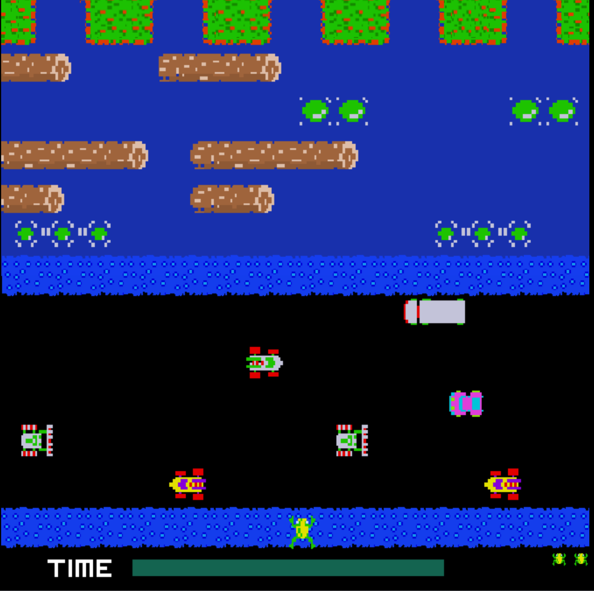
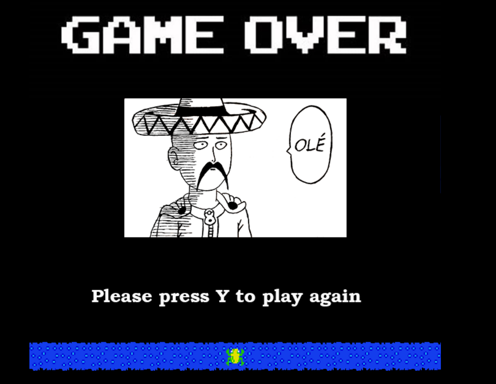

# FrogGame

# Description
This is a 2D game I made myself during University.In the game you control a frog with keyboard w,s,a,d. You can jump with the frog up, down, left and right. The frog always jumps a fixed amount. For example in the Figure 1 the frog can move the distance of 13 jumps from bottom to top of the screen and from left to right.The objective of the game is to safely move your frog from its starting location in the bottom of the screen to the five safe slots in top of the screen.

# The applied technologies

## Front End

- **JavaScript**
- **HTML**
- **CSS**
- **HTML Canvas**
- **Adobe Photoshops**

# Features

- Safe zones are horizontal areas, which are totally safe for the frog. There no danger present and the frog can move freely horizontally.
- Black asphalt area as such is not dangerous, but in that area there are lots of cars moving horizontally, which are lethal.
- Cars drive on black asphalt and they move horizontally. There are five rows, or lanes, of cars and each lane has traffick going on different direction. Lane 1, from the bottom, has traffic driving left. Lane 2 has traffick driving right. Lane 3 left again, lane 4 right and lane 5 left.
- Water is area, which result in instant death for the frog. Water is similar to black asphalt that there are five rows objects moving left and right on it.
- Logs and turtles are objects which are moving left and right on water. The frog can move on top of logs and turtles and is moved with them as they move. Turtles are special in the way that they can submerge every now and then.
- Goal slots are five slots where the frog should reach. When the frog reaches a goal slot the frog is respawned back to start location and the slot is taken. The frog cannot move between goal slots (the green area)
- When frog spawns on the starting location a 40 second timer is started. The frog must reach goal slots before time runs out.
- The player has three frogs or lives.
  
# Usage
Clone my code repository and open index-Frogger.html
